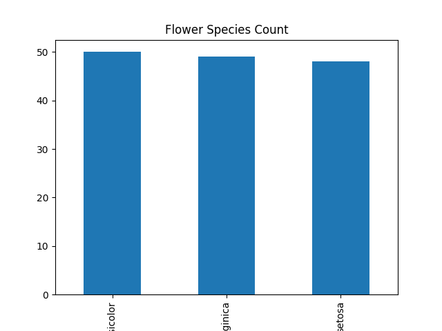
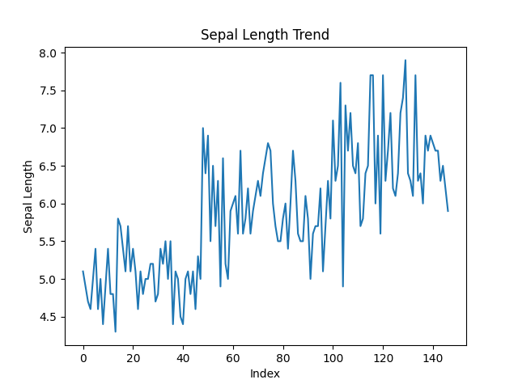
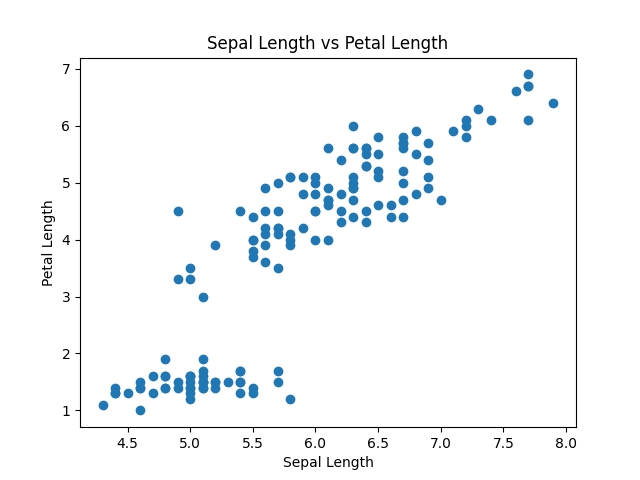

Iris Data Visualization Project

This project explores the Iris flower dataset using Python, Pandas, Matplotlib, and Seaborn.

Project Objectives

* Create basic visualizations
* Understand data relationships
* Practice beginner data analytics skills

Tools Used

* Python
* Pandas
* Matplotlib
* Seaborn
* Google Colab

Visualizations Created

* Bar Chart
* 
* Line Chart
* 
* Scatter Plot
* 

Dataset

The Iris dataset contains flower measurements and species classifications.

🔗LinkedIn Update:
https://www.linkedin.com/posts/glory-anaga_github-anagaglorycodvedadatavisuslizationtask2-share-7466056507084763136-ck0b/?utm_source=share&utm_medium=member_ios&rcm=ACoAAEzcjzYBKYK0E8nWmeqz2AhiJ-Qde3g72iM 

Author

Glory Anaga
